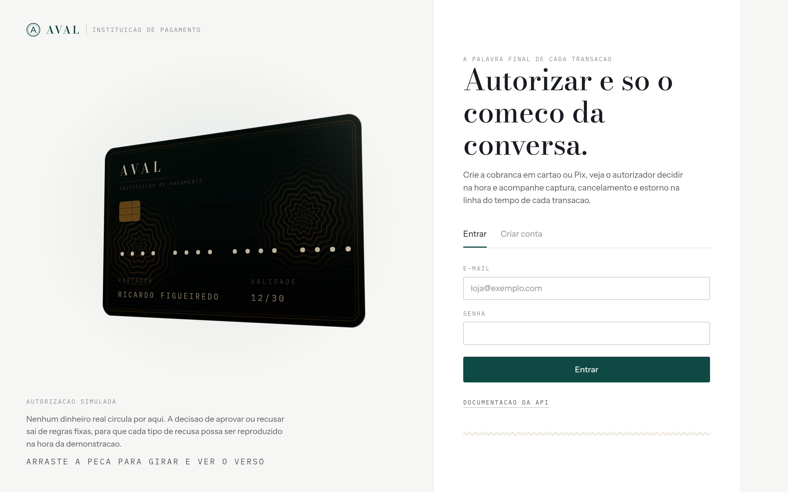
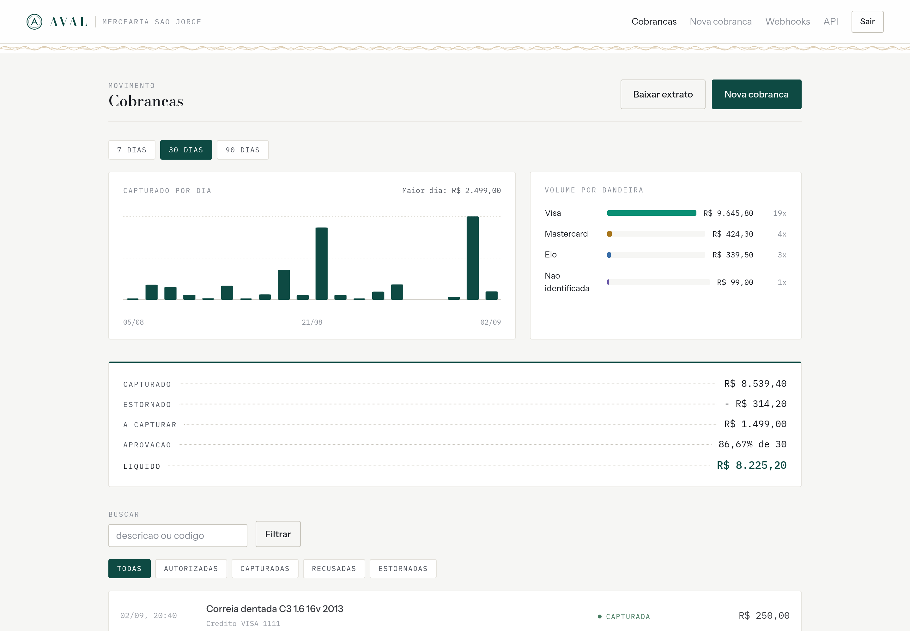
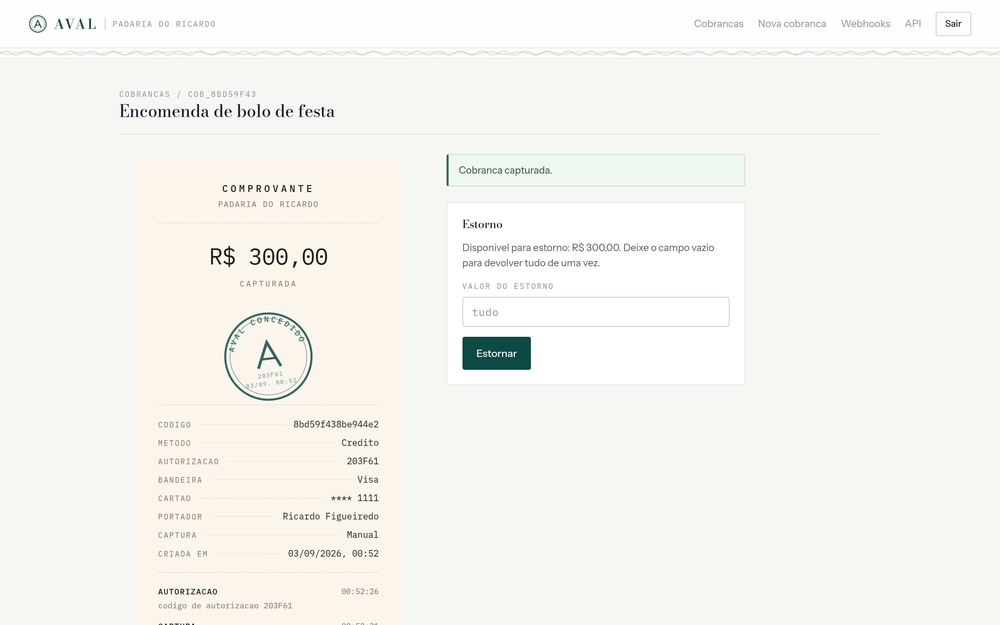

# Gateway de Pagamentos

API REST que simula o núcleo de um gateway de pagamentos: cria cobranças, decide se autoriza ou recusa,
captura, cancela e estorna, mantendo a trilha de auditoria de cada transição. Foi escrita para servir de
backend a um aplicativo nativo, então todas as respostas são JSON e a autenticação é por token JWT, sem
sessão no servidor.

Não existe adquirente de verdade do outro lado. A decisão de autorização é tomada por um componente
simulado com regras fixas e determinísticas, descritas mais abaixo, para que o aplicativo cliente consiga
testar tanto o caminho feliz quanto cada tipo de recusa.

**Autor:** Ricardo Figueiredo
**Matrícula:** 202310773
**Disciplina:** Laboratório de Desenvolvimento de Aplicações Nativas

## Demonstração em produção

Para visualizar o painel já preenchido, acesse a aplicação com a conta abaixo:

| Acesso | Valor |
|---|---|
| Aplicação | [gateway-aula.malha.app](https://gateway-aula.malha.app) |
| E-mail | `demo@aval.app` |
| Senha | `demonstracao2026` |

A conta possui 36 cobranças distribuídas pelos últimos quarenta e cinco dias,
incluindo aprovações, recusas por cada motivo, captura manual, cancelamento e
estornos parciais e totais.

A conta é pública de propósito, para que a avaliação não dependa de cadastro. O
que estiver nela pode ser alterado por qualquer pessoa que abra o link, e nada
disso movimenta dinheiro. Para refazer o povoamento do zero:
`cd web && npm run semear`.

## Painel

O repositorio traz tambem o painel em Next.js que consome esta API, na pasta
`web/`. Ele tem identidade propria, chamada **Aval**, documentada em
`web/MARCA.md`: nome, simbolo, paleta, tipografia, regras de movimento e voz.

A peca tridimensional da tela de entrada e um cartao de metal gravado em
guilhoche, o mesmo desenho de linhas concentricas de cedula e apolice,
calculado curva por curva em um shader com Three.js. Ela nao gira sozinha, gira
quando arrastada, e o verso tem tarja, painel de assinatura e letra miuda. No
formulario de nova cobranca a mesma peca reflete o que esta sendo digitado,
mostrando bandeira e numero na hora.

O momento da marca e o carimbo de aval, que bate no comprovante quando a
transacao e aprovada.

```bash
cd web
npm install
npm run dev     # painel em localhost:3000, com a API em localhost:8080
npm run prints  # percorre o painel em Chromium headless e grava as telas
```

Telas em `web/prints/`.







## Stack

- Java 21
- Spring Boot 3.5.16 (Web, Data JPA, Validation, Security)
- PostgreSQL 17 em produção, H2 em memória no perfil padrão e nos testes
- Flyway para versionamento do banco
- springdoc-openapi para a documentação interativa
- JJWT para emissão e validação dos tokens
- JUnit 5, AssertJ e MockMvc nos testes

## Como rodar

O perfil padrão sobe com H2 em memória, então não é preciso instalar banco nenhum:

```bash
./mvnw spring-boot:run
```

A API fica em `http://localhost:8080` e a documentação interativa em
`http://localhost:8080/swagger-ui.html`. Pelo Swagger dá para autenticar no botão Authorize e disparar
todas as chamadas sem precisar de Postman.

Para rodar contra PostgreSQL, use o perfil `prod` e informe as variáveis de ambiente:

```bash
export SPRING_PROFILES_ACTIVE=prod
export GATEWAY_DB_URL=jdbc:postgresql://localhost:5432/gateway
export GATEWAY_DB_USUARIO=gateway
export GATEWAY_DB_SENHA=sua-senha
export GATEWAY_JWT_SEGREDO=uma-chave-com-pelo-menos-32-caracteres
./mvnw spring-boot:run
```

As tabelas são criadas pelo Flyway na subida, a partir de `src/main/resources/db/migration`.

## Testes

```bash
./mvnw test
```

São 110 testes divididos em três níveis: as regras de cartão e do autorizador em testes de unidade puros,
a máquina de estados da cobrança em cima da entidade de domínio e o fluxo completo em testes de
integração que sobem o contexto do Spring e chamam a API por HTTP, usando as mesmas migrations do Flyway
que rodam em produção.

O JaCoCo mede a cobertura e o relatório sai em `target/site/jacoco/index.html`. Hoje o projeto está em
**92% de instruções e 83% de ramos**, e `./mvnw verify` reprova abaixo disso. O que falta coberto são
caminhos de borda que ainda não têm teste: o `main`, o filtro JWT com token de usuário removido, alguns
acessores de entidade e o tratamento de erro de conflito.

## Autenticação

Cada estabelecimento se cadastra, faz login e recebe um token JWT com validade de duas horas. Todas as
rotas de cobrança exigem o cabeçalho `Authorization: Bearer <token>` e só enxergam as cobranças do
próprio estabelecimento: pedir uma cobrança de outro dono devolve 404, não 403, para não revelar que o
recurso existe.

```bash
curl -X POST http://localhost:8080/api/v1/autenticacao/registro \
  -H 'Content-Type: application/json' \
  -d '{"email":"loja@exemplo.com","senha":"senhaforte123","nomeEstabelecimento":"Padaria do Ricardo"}'

curl -X POST http://localhost:8080/api/v1/autenticacao/login \
  -H 'Content-Type: application/json' \
  -d '{"email":"loja@exemplo.com","senha":"senhaforte123"}'
```

## Endpoints

| Método | Rota | O que faz |
|---|---|---|
| POST | `/api/v1/autenticacao/registro` | Cadastra o estabelecimento |
| POST | `/api/v1/autenticacao/login` | Troca e-mail e senha por um token |
| GET | `/api/v1/autenticacao/eu` | Dados do dono do token |
| POST | `/api/v1/cobrancas` | Cria a cobrança e roda a autorização |
| GET | `/api/v1/cobrancas` | Lista paginada, com filtro por `status` e `metodo` |
| GET | `/api/v1/cobrancas/{codigo}` | Consulta uma cobrança |
| POST | `/api/v1/cobrancas/{codigo}/captura` | Captura uma cobrança autorizada |
| POST | `/api/v1/cobrancas/{codigo}/cancelamento` | Desfaz a autorização antes da captura |
| POST | `/api/v1/cobrancas/{codigo}/estornos` | Estorna no todo ou em parte |
| GET | `/api/v1/cobrancas/{codigo}/estornos` | Lista os estornos da cobrança |
| GET | `/api/v1/cobrancas/{codigo}/eventos` | Linha do tempo da cobrança |
| GET | `/api/v1/cobrancas/resumo` | Fechamento do período, somado pelo banco |
| GET | `/api/v1/cobrancas/movimento` | Volume capturado por dia |
| GET | `/api/v1/cobrancas/bandeiras` | Participação de cada bandeira |
| POST | `/api/v1/webhooks` | Cadastra um endpoint e devolve o segredo |
| GET | `/api/v1/webhooks` | Lista os endpoints, com o segredo mascarado |
| POST | `/api/v1/webhooks/{codigo}/situacao` | Liga ou desliga o envio |
| DELETE | `/api/v1/webhooks/{codigo}` | Remove o endpoint e o histórico |
| GET | `/api/v1/webhooks/{codigo}/entregas` | Histórico de entregas |
| POST | `/api/v1/webhooks/entregas/{codigo}/reenvio` | Devolve uma entrega para a fila |
| POST | `/api/v1/webhooks/eco` | Alvo de treino: responde 200 e confere a assinatura recebida |
| GET | `/saude` | Verificação de disponibilidade, sem autenticação |

Valores trafegam sempre em centavos, como número inteiro. Isso evita erro de arredondamento de ponto
flutuante e é o formato que os gateways de mercado usam.

## Pix

Cobrança no Pix devolve o campo `pixCopiaECola`, montado no formato EMV QRCPS-MPM
do Manual de Padrões para Iniciação do Pix. O payload é uma sequência de campos no
formato identificador, tamanho e valor, com o arranjo `br.gov.bcb.pix` dentro do
campo 26 e o CRC16 CCITT fechando sobre tudo o que veio antes, inclusive o próprio
`6304`. O painel desenha o QR a partir dessa string, sem serviço externo.

O código é estruturalmente válido e passa nos leitores, mas aponta para uma chave de
demonstração: nenhum banco liquida nada a partir dele.

## Parcelamento

De uma a doze vezes, apenas no cartão de crédito, com parcela mínima de R$ 5,00. O
troco da divisão cai na primeira parcela, que é como as adquirentes fazem, e a
resposta traz `valorDaParcelaEmCentavos` e `ajusteNaPrimeiraParcelaEmCentavos`
separados para não esconder o arredondamento.

## Webhooks

O estabelecimento cadastra endpoints e passa a ser avisado de cada mudança:
`cobranca.autorizada`, `cobranca.capturada`, `cobranca.recusada`,
`cobranca.cancelada` e `cobranca.estornada`.

A entrega é gravada na mesma transação que muda a cobrança e só depois sai pela
rede, em processo separado. São duas garantias de uma vez: transação desfeita não
dispara aviso falso, e processo derrubado não perde aviso já confirmado. Disparar
HTTP dentro da transação daria o problema oposto nas duas pontas.

Cada envio leva o cabeçalho `Aval-Assinatura` no formato `t=<instante>,v1=<hmac>`. O
que é assinado não é só o corpo, é a junção `<instante>.<corpo>`. Amarrar o instante
dentro do material assinado impede reapresentar a requisição depois, porque mudar o
`t` exigiria refazer o HMAC, e para isso seria preciso o segredo. Do lado de quem
recebe, a conferência tem duas partes: refazer o HMAC-SHA256 e comparar em tempo
constante, e recusar o que tiver mais de cinco minutos.

```java
String material = instante + "." + corpo;
byte[] esperado = hmacSha256(segredo, material);
boolean valido = MessageDigest.isEqual(esperado, assinaturaRecebida)
        && Math.abs(agora - instante) <= 300;
```

Entrega sem resposta 2xx volta para a fila com espera crescente: um minuto, cinco,
meia hora, duas horas, seis horas. Depois disso fica registrada como falha, à espera
de reenvio manual.

Para experimentar sem montar servidor, aponte um endpoint para
`POST /api/v1/webhooks/eco`: ele responde 200 e devolve a assinatura recebida, e
com o parâmetro `segredo` diz se ela confere.

A URL de destino passa por duas conferências contra requisição forjada do lado do
servidor. No cadastro, recusando IP privado e nome local escritos na mão. E de novo
antes de cada envio, resolvendo o nome, porque um domínio público pode passar a
apontar para endereço interno depois.

## Estados da cobrança

```
AUTORIZADA ---> CAPTURADA ---> PARCIALMENTE_ESTORNADA ---> ESTORNADA
     |               |
     |               +--------> ESTORNADA (estorno total de uma vez)
     |
     +--> CANCELADA

RECUSADA, CANCELADA e ESTORNADA são estados finais.
```

As transições estão implementadas dentro da própria entidade `Cobranca`, e não no service. Assim nenhuma
camada consegue deixar a cobrança em um estado impossível, como capturar algo que já foi cancelado.
Tentativa de transição inválida devolve 422 com a explicação no corpo.

## Regras do autorizador simulado

São aplicadas nesta ordem:

1. valor acima do limite por transação, hoje R$ 10.000,00, devolve `LIMITE_EXCEDIDO`
2. Pix é sempre aprovado, porque não há análise de crédito envolvida
3. bandeira não reconhecida devolve `BANDEIRA_NAO_SUPORTADA`
4. cartão com validade anterior ao mês corrente devolve `CARTAO_EXPIRADO`
5. cartão terminado em 0000 devolve `CARTAO_BLOQUEADO`
6. cartão terminado em 0001 devolve `SALDO_INSUFICIENTE`
7. qualquer outro caso é aprovado

O relógio usado na regra de vencimento é injetado, o que permite aos testes fixar uma data e verificar o
comportamento sem depender do dia em que a suíte roda.

### Cartões para teste

| Número | Resultado |
|---|---|
| 4111111111111111 | Aprovado, bandeira Visa |
| 5555555555554444 | Aprovado, bandeira Mastercard |
| 5099990000000003 | Aprovado, bandeira Elo |
| 378282246310005 | Aprovado, bandeira Amex |
| 4111000000080000 | Recusado por cartão bloqueado |
| 4111000000070001 | Recusado por saldo insuficiente |
| 9999000000000004 | Recusado por bandeira não suportada |

Todos passam no algoritmo de Luhn. Número que não passa no dígito verificador é rejeitado antes de
chegar ao autorizador.

## Dados do cartão

O número completo existe apenas dentro do método de fábrica de `CartaoTokenizado` e nunca é gravado nem
registrado em log. O que fica no banco é o BIN, os quatro últimos dígitos, a bandeira e o nome impresso,
que é o suficiente para o aplicativo mostrar o cartão na tela e para o estabelecimento conciliar a venda.

## Idempotência

O aplicativo pode enviar o cabeçalho `Idempotency-Key` no POST de cobrança. Se a chave já tiver sido
usada por aquele estabelecimento, a cobrança original volta com status 200 em vez de uma nova ser criada,
que é o comportamento esperado quando o celular perde a rede no meio da requisição e o usuário tenta de
novo. A garantia final é uma constraint de unicidade em `(usuario_id, chave_idempotencia)`, então nem
duas requisições simultâneas conseguem furar a regra.

## Exemplo de uso

```bash
TOKEN="cole-o-token-aqui"

curl -X POST http://localhost:8080/api/v1/cobrancas \
  -H "Authorization: Bearer $TOKEN" \
  -H 'Content-Type: application/json' \
  -H 'Idempotency-Key: pedido-1042' \
  -d '{
        "valorEmCentavos": 30000,
        "descricao": "Encomenda de bolo",
        "metodo": "CARTAO_CREDITO",
        "capturaAutomatica": false,
        "cartao": {
          "numero": "4111111111111111",
          "validadeMes": 12,
          "validadeAno": 2030,
          "nomePortador": "Ricardo Figueiredo"
        }
      }'

curl -X POST http://localhost:8080/api/v1/cobrancas/cob_xxx/captura -H "Authorization: Bearer $TOKEN"

curl -X POST http://localhost:8080/api/v1/cobrancas/cob_xxx/estornos \
  -H "Authorization: Bearer $TOKEN" \
  -H 'Content-Type: application/json' \
  -d '{"valorEmCentavos": 10000, "motivo": "cliente devolveu metade"}'
```

Resposta da criação:

```json
{
  "codigo": "cob_a88cfda086b342749d05bf6d0e6bd697",
  "valorEmCentavos": 30000,
  "valorEstornadoEmCentavos": 0,
  "saldoEstornavelEmCentavos": 30000,
  "moeda": "BRL",
  "descricao": "Encomenda de bolo",
  "metodo": "CARTAO_CREDITO",
  "status": "AUTORIZADA",
  "codigoAutorizacao": "203F61",
  "capturaAutomatica": false,
  "cartao": {
    "bandeira": "VISA",
    "bin": "411111",
    "ultimosQuatro": "1111",
    "nomePortador": "Ricardo Figueiredo"
  },
  "criadoEm": "2026-09-02T22:13:53.926891197Z",
  "atualizadoEm": "2026-09-02T22:13:53.926891197Z"
}
```

## Erros

Todo erro sai no formato RFC 7807, com `title`, `status` e `detail`. Erro de validação traz também o
objeto `campos`, com a mensagem de cada campo reprovado:

```json
{
  "title": "Requisicao invalida",
  "status": 400,
  "detail": "Um ou mais campos nao passaram na validacao.",
  "campos": { "valorEmCentavos": "o valor deve ser maior que zero" }
}
```

Os códigos usados são 400 para entrada malformada, 401 sem token válido, 404 para cobrança inexistente
ou de outro estabelecimento, 409 para conflito de cadastro ou de chave de idempotência e 422 para
operação proibida pela regra de negócio.

## Organização do código

```
src/main/java/br/com/ricardofigueiredo/gateway
├── autorizacao   tokenização do cartão, bandeiras e o autorizador simulado
├── cobranca      entidade raiz, estornos, eventos, service e controller
├── comum         tratamento de erro, paginação e verificação de disponibilidade
├── config        segurança, OpenAPI e o relógio injetável
├── seguranca     emissão do JWT, filtro de autenticação e resposta de 401
└── usuario       estabelecimento, cadastro e login
```

## Onde está rodando

A aplicação está publicada em um container LXC dentro de um Proxmox VE. Dentro do container há três
processos: o PostgreSQL, a API empacotada como jar na porta 8081 e o painel Next.js na porta 3000, os
dois últimos sob systemd com reinício automático nas unidades `gateway-pagamentos.service` e
`gateway-web.service`. Um nginx na frente serve o painel em `/` e encaminha `/api`, `/saude` e a
documentação para a API, de modo que painel e API compartilham a mesma origem e não existe CORS no
caminho.

- Painel: https://api-gateway-aula.malha.app
- API e documentação: https://api-gateway-aula.malha.app/swagger-ui.html

As credenciais de banco e o segredo do JWT ficam fora do repositório, em um arquivo de ambiente lido
pelas unidades do systemd.
